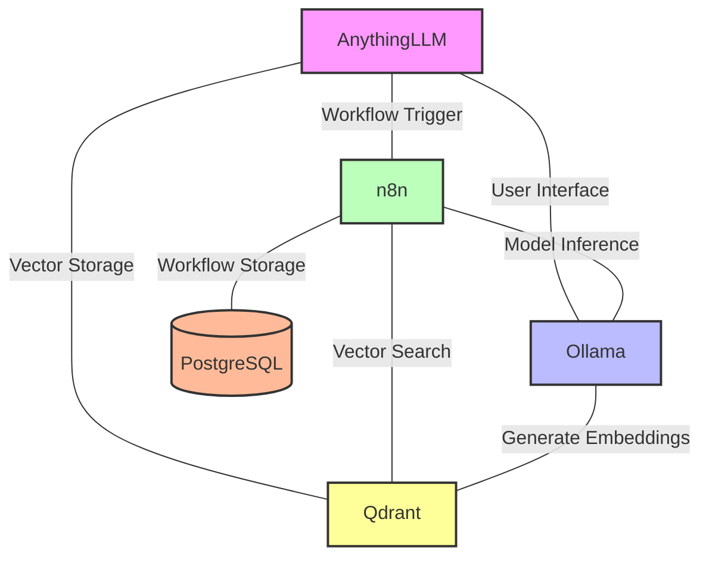

## Component Descriptions

- **AnythingLLM**: Frontend interface that users interact with for LLM operations
- **Ollama**: Handles AI model serving and inference tasks
- **n8n**: Manages workflow automation and orchestrates the entire process
- **PostgreSQL**: Stores workflow configurations and system data
- **Qdrant**: Vector database that manages embeddings for semantic search
